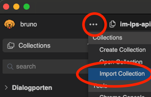

# HAG API testing katalog

En maskinporten token server og katalog av HTTP requests for internt bruk.

Start serveren:
```
gcloud auth login

git clone https://github.com/navikt/hag-api-testing-katalog.git

hag-api-testing-katalog/release/bin/start
```

Test å hente en dialog fra Dialogporten:
```
curl -X 'GET' \
'https://platform.tt02.altinn.no/dialogporten/api/v1/serviceowner/dialogs/0194bc95-97b4-7240-961f-9663743d4518' \
-H 'accept: application/json' \
-H "Authorization: Bearer $(curl -sX GET http://localhost:4242/token/sykepenger-im-lps-api)" \
| jq
```

Test HTTP requests i Bruno/Postman alternativ:
```
brew install bruno
```
Etter du har åpnet opp bruno trykk på de tre dottene og "import collection", velg deretter `im-lps-api.json` som ligger lokalt i prosjektet.




## Getting started med token server
Husk å logge inn på gcloud før du kjører serveren.

### Eksempel bruk:
```
HTTP GET: 
http://localhost:4242/token/sykepenger-im-lps-api

Response: 
eyJraOiwKvLNpXieJdPncEitGjVFokDmal... (maskinporten token)
```

## Hvordan fungerer serveren?

Serveren bruker lokalt konfigurert kubectl config i dev-gcp miljøet.

**Route: `http://localhost:4242/token/{tjeneste-navn}`**

Serveren finner første substring match for `{tjeneste-navn}` i listen av maskinporten secrets tilgjengelige for helsearbeidsgiver.

Maskinporten JWK secrets for dev-gcp blir "cached" i minne til serveren.

Disse JWK secrets brukes for å hente nye maskinporten tokens for hver request for `{tjeneste-navn}`.


## Obs!

- Om du prøver en å hente token for en ny tjeneste som ikke er "cached" fra tidligere så kan du være utlogget på GCloud.
- JWK secrets kan blu utdaterte! Da må serveren startes på nytt for å få "cache" nye JWK verdier.