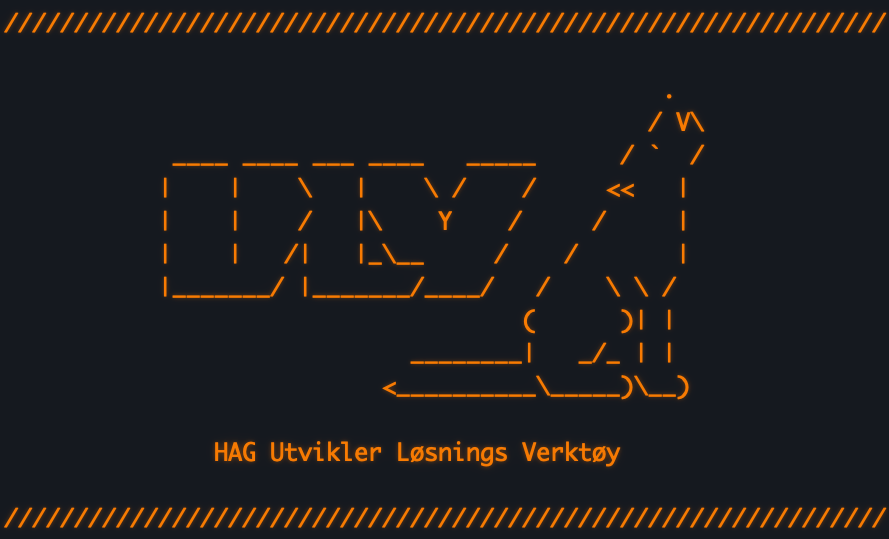
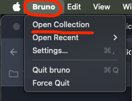
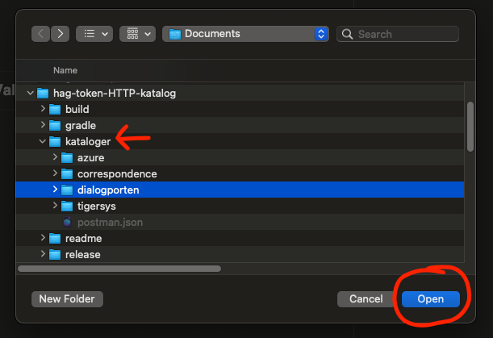
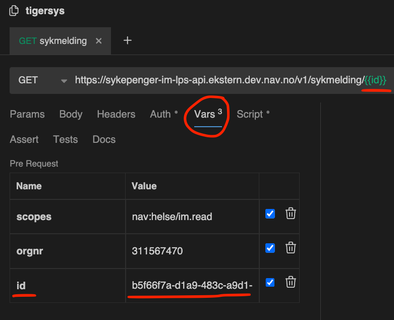
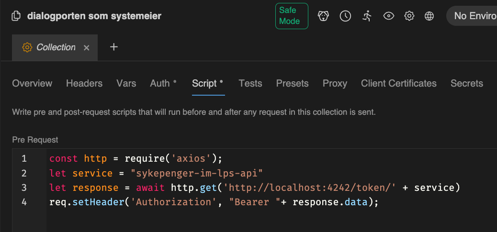

# HAG ULV



ULV (Utvikler Løsnings Verktøy) er et sett med verktøy for å forenkle testing lokalt.

- **Kafka-UI:** Observability i Kafka topics og meldinger samt produsere meldinger for testing use cases.
- **Bruno:** Delt kataloger (som Postman) for HTTP kall med automatisert autentisering.


## Kom i gang
Login i gcp om du ikke er logget inn fra før:
```bash
gcloud auth login
```
Start ULV:
```bash
gradle run
```

Test med CURL ved å lese dialog i Altinn 3 med id `0194bc95-97b4-7240-961f-9663743d4518` og token for `sykepenger-im-lps-api`
```bash
curl -X 'GET' \
'https://platform.tt02.altinn.no/dialogporten/api/v1/serviceowner/dialogs/0194bc95-97b4-7240-961f-9663743d4518' \
-H 'accept: application/json' \
-H "Authorization: Bearer $(curl -sX GET http://localhost:4242/token/sykepenger-im-lps-api)" \
| jq
```

## Sette opp Bruno

Bruno er et open source alternativ til Postman som er designet for å dele innhold med team i git repo. 

Alle HTTP kall for Bruno befinner seg i `kataloger` mappen.

Når du gjør endringer i Bruno oppdateres automatisk filene i mappen.

Katalogene bruker ULV for å automatisk hente tokens ved bruk av pre-request scripts [(bruno eksempel)](./readme/bruno-prescript-eksempel.png).

Mac installasjon:

```bash
brew install bruno && open /Applications/Bruno.app
```

### Hvordan å laste inn Bruno kataloger:

```
Øverst til venstre  Apple meny: Bruno > Open Collection > hag-ulv/kataloger/dialogporten
```





Variabler er satt i `vars` vinduet og kan brukes i URL og i pre-request scripts.

  


Scripts er satt i `pre-request` vinduet. Denne henter tokens automatisk.  
(kan defineres for hele katalogen eller for enkelt requests)





### (Postman)
En Postman json demo er inkludert med et enkelt eksempel på hvordan å sette opp pre-request scripts for å hente tokens automatisk.

Mac menu bar: `File` > `Import Collection` > `hag-api-testing-katalog/kataloger/postman.json`

## Endepunkter

Koden for endepunktene ligger i [./src/main/kotlin/Routing.kt](./src/main/kotlin/Routing.kt)

## Hvordan fungerer serveren?

Serveren bruker lokalt konfigurert kubectl config som er alltid satt til dev-gcp.

**Route: `http://localhost:4242/token/{tjeneste-navn}`**

Serveren finner første substring match for `{tjeneste-navn}` i listen av maskinporten secrets tilgjengelige for helsearbeidsgiver.

Maskinporten JWK secrets for dev-gcp blir "cached" i minne til serveren.

Disse JWK secrets brukes for å hente nye maskinporten tokens for hver request for `{tjeneste-navn}`.


## Obs!

- Om du prøver en å hente token for en ny tjeneste som ikke er "cached" fra tidligere så kan du være utlogget på GCloud.
- JWK secrets kan i sjeldne tilfeller bli utdaterte! Da må serveren startes på nytt.


## Ekstra

Et [påskeegg](https://www.nrk.no/filmpolitiet/et-annerledes-paskeegg-1.17237361) er at port 4242 som serveren bruker er *hag* delvis skrevet på [T9 tastatur](https://no.wikipedia.org/wiki/T9):

```
 _______________________
| 1     | 2 abc | 3 def |
| -     |       |       |
|_______|_______|_______|
| 4 ghi | 5 jkl | 6 mno |
|       |       |       |
|_______|_______|_______|
| 7 pqrs| 8 tuv | 9 wxyz|
|       |       |       |
|_______|_______|_______|
|   *   |   0   |   #   |
|       |       |       |
|_______|_______|_______|
```